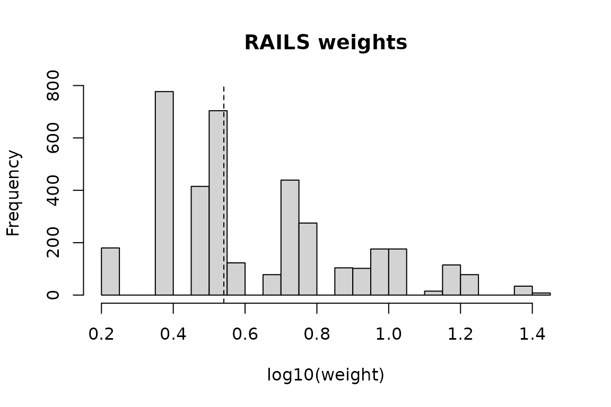

# Getting started with RAILS

``` r

library(RAILS)
```

## The problem

A volunteer biobank recruits whoever signs up. The people who sign up
are not a random draw from the population: they skew older, wealthier,
better educated, and — the part that matters — those characteristics are
associated with the health outcomes the biobank exists to study. Any
prevalence estimated directly from the cohort is biased for the
population.

A probability survey, by contrast, is designed. Its design weights are
known, and its margins represent the population. It is usually far
smaller than the biobank and does not measure what the biobank measures.

RAILS uses the second to fix the first.

## A population where we know the answer

Real biobank microdata cannot be redistributed, so this vignette uses
[`rails_simulate()`](https://extrasane.github.io/RAILSpkg/reference/rails_simulate.md),
which generates a population, a probability sample, and a volunteer
sample whose inclusion depends on the same covariates that drive the
outcome. Because we simulated the population, we know the truth.

``` r

pop <- rails_simulate(20000, seed = 42)

aou <- pop[pop$aou == 1, ]        # the volunteer sample
ref <- pop[pop$s == 1, ]          # the probability sample
ref$dweight <- 1 / ref$ps         # its design weights

c(population = nrow(pop), volunteer = nrow(aou), reference = nrow(ref))
#> population  volunteer  reference 
#>      20000       3799       4878
```

The bias is visible before any modelling. The volunteer sample
over-represents the higher income groups:

``` r

round(rbind(
  population = prop.table(table(pop$income)),
  volunteer  = prop.table(table(aou$income))
), 3)
#>            p0-10 p10-50 p50-90 p90-100
#> population 0.100   0.40  0.400    0.10
#> volunteer  0.056   0.32  0.465    0.16
```

and its raw outcome prevalence is off:

``` r

c(truth = mean(pop$y), unweighted = mean(aou$y))
#>      truth unweighted 
#>  0.1952000  0.2545407
```

## Fitting

[`rails()`](https://extrasane.github.io/RAILSpkg/reference/rails.md)
takes the two samples, the covariates they share, and the reference
sample’s design weights. Two further arguments say which models the
search runs between: `start` is the model taken as given, `scope` the
largest model selection may reach.

Here the volunteer-selection process contains two-way structure, so we
start from main effects and let the forward test look for the two-way
interactions:

``` r

fit <- rails(
  np   = aou,
  ref  = ref,
  vars = c("agegroup", "sex", "income"),
  weights_ref = "dweight",
  start = 1,          # main effects, taken as given
  scope = 2,          # two-way interactions are the candidates
  verbose = FALSE
)

fit
#> RAILS fit
#>   covariates   : agegroup, sex, income
#>   start model  : 3 term(s)
#>   scope        : 6 term(s), so 3 candidate(s)
#>   selected     : 2 term(s) at alpha = 0.05
#>                  agegroup:sex, sex:income
#>   raked        : 2 of 2 selected term(s) survived the stepwise walk
#>   cells        : 24
#>   weights      : n = 3799, sum = 19,875.78, range 1.65 to 25.9
```

Three things happened. A propensity model was fitted on the starting
model. Every term in `scope` but not in `start` was offered to a forward
likelihood-ratio test, and those passing at `alpha = 0.05` were kept.
Then the selected terms were added back one at a time, raking to the
reference margins at each step and stopping at the first step that
failed to converge.

The defaults are `start = 2, scope = 3`, which is the published
estimator: main effects and two-way interactions taken as given,
three-way interactions offered for selection.

[`summary()`](https://rdrr.io/r/base/summary.html) shows the selection
path and how well behaved the weights are:

``` r

summary(fit)
#> RAILS fit summary
#> 
#> Covariates: agegroup, sex, income
#> Model     : 3 term(s) in the starting model, 3 candidate(s) in scope, alpha 0.05
#> 
#> Selected terms (2):
#>   1. agegroup:sex
#>   2. sex:income
#> 
#> Raked to 5 term(s); full walk completed.
#> 
#> Weight diagnostics:
#>                sum                var non_positive_ratio          below_one 
#>         19875.7840            16.4808             0.0000             0.0000 
#>                min                max 
#>             1.6543            25.8569 
#> 
#> Design effect (Kish): 1.602
#> Effective sample size: 2371.5
```

The design effect is the price of weighting: it is the factor by which
unequal weights inflate the variance of a mean, so an effective sample
size well below the nominal one is normal and expected. A design effect
that is very large signals a handful of records carrying the estimate,
which is worth looking at:

``` r

plot(fit)
```



## Using the weights

``` r

w <- weights(fit)

c(truth      = mean(pop$y),
  unweighted = mean(aou$y),
  rails      = sum(w * aou$y) / sum(w))
#>      truth unweighted      rails 
#>  0.1952000  0.2545407  0.2051237
```

The weights sum to the population total implied by the reference sample,
and reproduce its margins by construction:

``` r

round(rbind(
  reference = tapply(ref$dweight, ref$income, sum),
  rails     = tapply(w, aou$income, sum)
))
#>           p0-10 p10-50 p50-90 p90-100
#> reference  2017   7975   7953    1932
#> rails      2017   7975   7953    1932
```

## Standard errors

[`rails_var()`](https://extrasane.github.io/RAILSpkg/reference/rails_var.md)
gives the standard error and interval for the weighted mean. By default
it reports the *simplified* variance, which treats the weights as fixed:

``` r

round(rails_var(fit, aou$y, truth = mean(pop$y)), 5)
#>         mu_hat      var_naive       se_naive ci_naive_lower ci_naive_upper 
#>        0.20512        0.00006        0.00762        0.19019        0.22006 
#>    cover_naive          N_hat           n_NP 
#>        1.00000    19875.78403     3799.00000
```

But the weights were estimated, not given. The *stacked* variance
accounts for that, through a sandwich over three estimating equations:
the propensity score, the raking constraints, and the mean itself. Ask
for both to see the gap:

``` r

v <- rails_var(fit, aou$y, type = "both", truth = mean(pop$y))
round(v[c("mu_hat", "se_naive", "se_full", "ratio_full_naive")], 5)
#>           mu_hat         se_naive          se_full ratio_full_naive 
#>          0.20512          0.00762          0.00747          0.98061
```

`ratio_full_naive` is the ratio of the two. Note that it is below 1
here: the stacked figure is the *smaller* one. Ignoring the propensity
stage tends to understate, but raking to known population margins
removes variance the way a regression estimator does, and in this
example the second effect wins. The stacked form is the one to report
because it accounts for how the weights were built – not because it is
the more conservative number.

The corresponding interval:

``` r

round(v[c("ci_full_lower", "ci_full_upper")], 4)
#> ci_full_lower ci_full_upper 
#>        0.1905        0.2198
```

The simplified form is the cheaper of the two by a wide margin – it
needs no model matrix at all – which is why it is the default. The
stacked form rebuilds individual-level model matrices, so it also needs
the fit to have been made with `keep_data = TRUE`.

## Downstream analysis

For anything beyond a mean, hand the weights to **survey**:

``` r

des <- rails_design(fit, aou)
survey::svymean(~y, des)
#>      mean     SE
#> y 0.20512 0.0076
```

Bear in mind that standard errors from this object are the naive ones,
for the same reason as above. Use it for point estimates and model
fitting; use
[`rails_var()`](https://extrasane.github.io/RAILSpkg/reference/rails_var.md)
for inference on a mean.

## Where to go next

- [`vignette("subgroup-rails")`](https://extrasane.github.io/RAILSpkg/articles/subgroup-rails.md)
  — running the estimator within strata, when subgroup estimates are the
  goal.
- [`?rails`](https://extrasane.github.io/RAILSpkg/reference/rails.md) —
  the full argument list, including `start` / `scope` for which models
  the search runs between, and `aggregated` for pre-built cell tables.
- [`?rails_cells`](https://extrasane.github.io/RAILSpkg/reference/rails_cells.md)
  and
  [`?rails_totals`](https://extrasane.github.io/RAILSpkg/reference/rails_totals.md)
  — building the aggregated inputs yourself, which is what you want when
  the microdata will not fit in one data frame.
- [`?pums_reference`](https://extrasane.github.io/RAILSpkg/reference/pums_reference.md)
  — building the reference sample from ACS PUMS instead of from a
  simulation:
  [`pums_fetch()`](https://extrasane.github.io/RAILSpkg/reference/pums_fetch.md)
  downloads it,
  [`pums_recode()`](https://extrasane.github.io/RAILSpkg/reference/pums_recode.md)
  bands the raw ACS codes into these same analysis variables, and
  [`pums_reference()`](https://extrasane.github.io/RAILSpkg/reference/pums_reference.md)
  returns the cleaned records, the cell table and the margins together.
